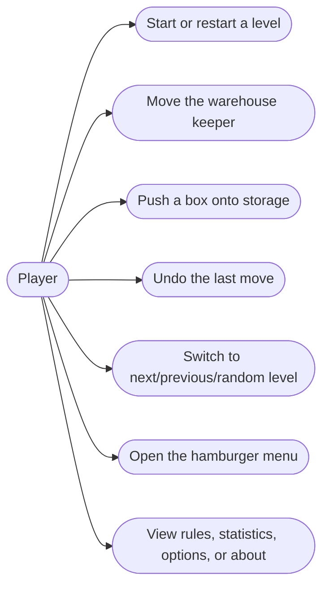
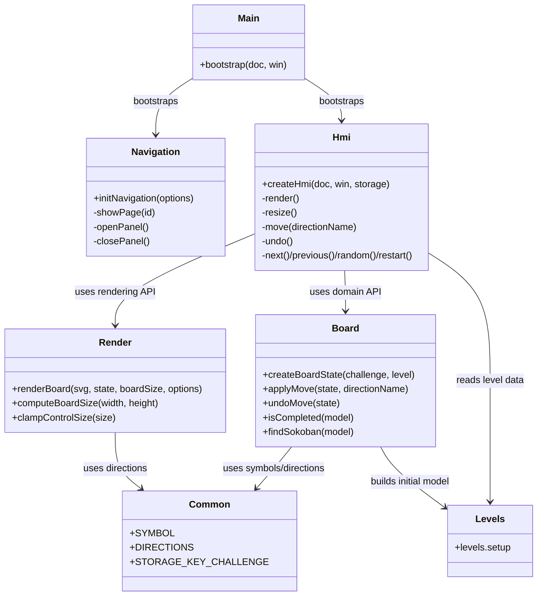
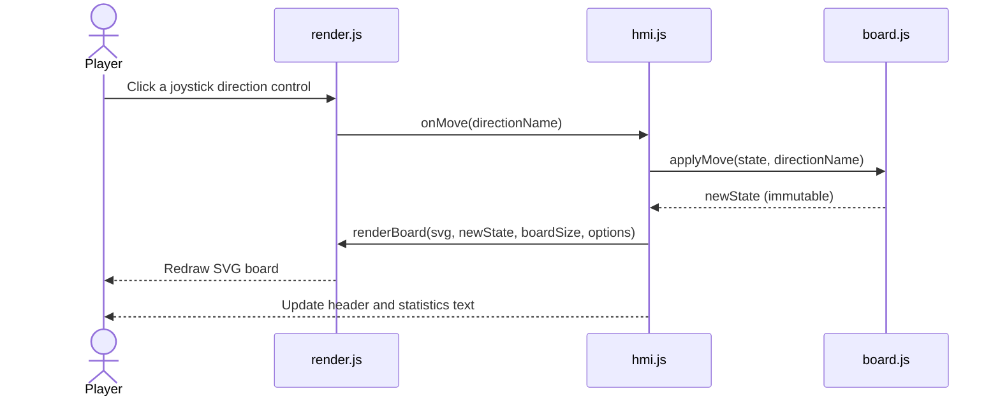
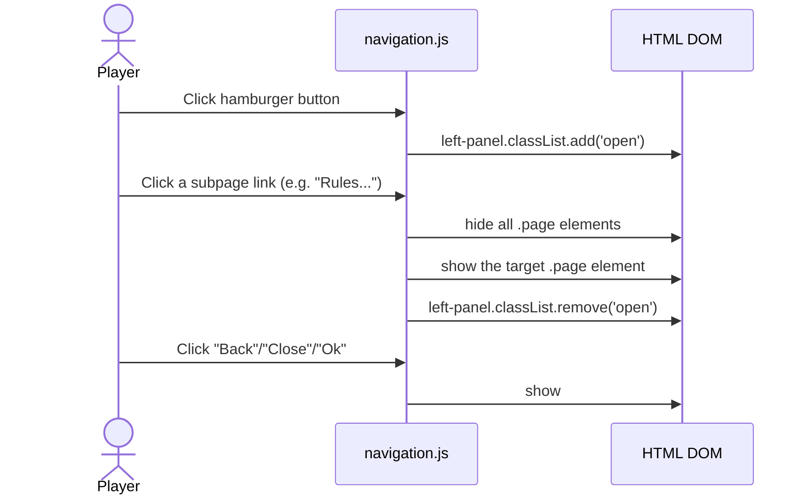
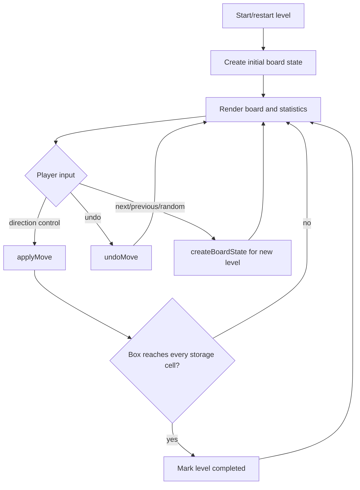
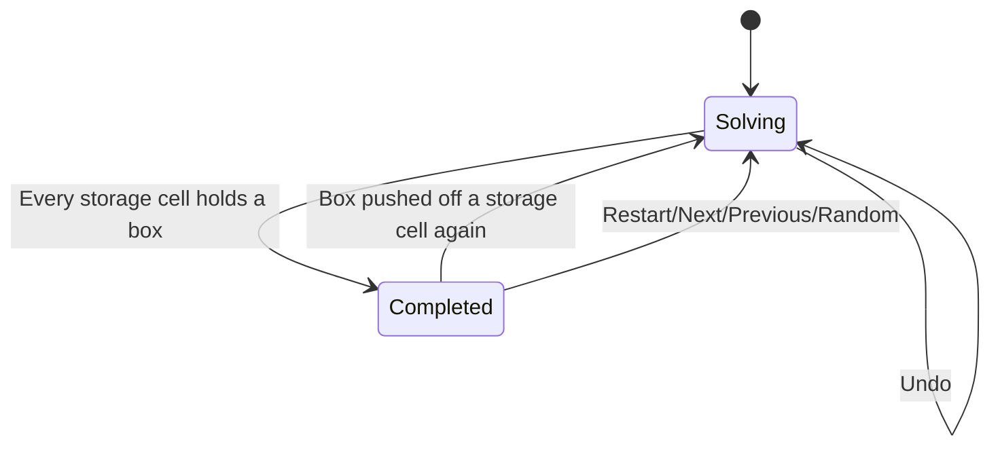
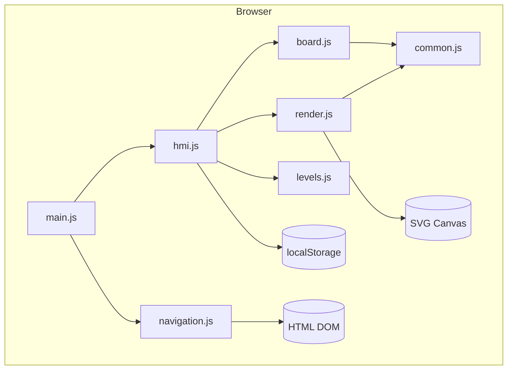
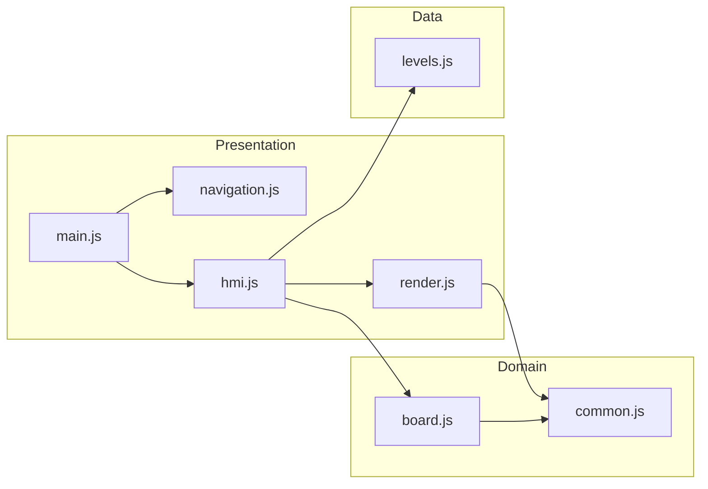
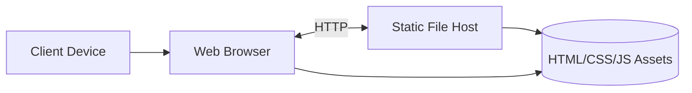
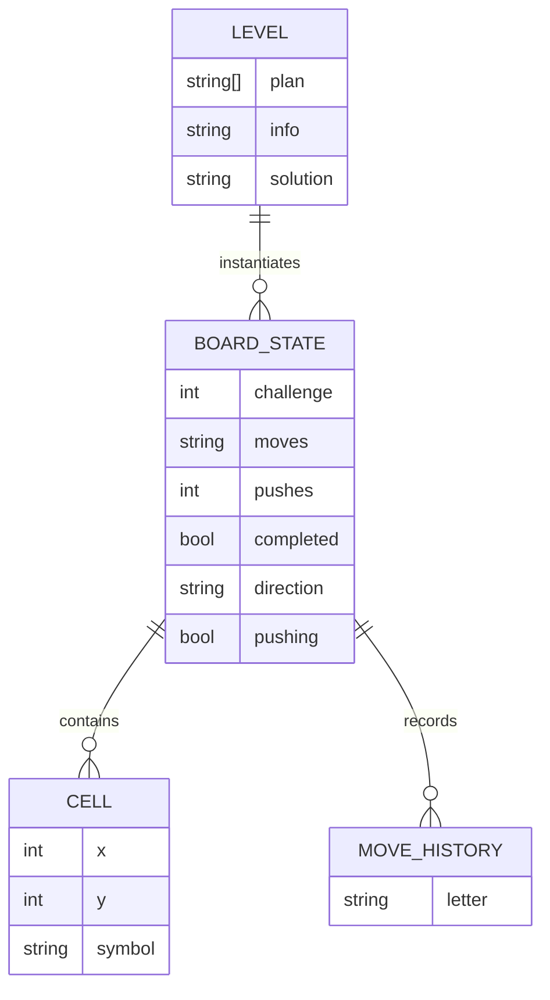

# Sokoban Software Architecture

## Goals

- No runtime dependencies on third-party JavaScript/CSS libraries.
- Move to modular ES modules with clear boundaries.
- Isolate board rules from rendering and from DOM/page navigation.
- Prefer immutable state transitions and pure domain logic.
- Keep the UI layer thin and focused on rendering and events.

## Architectural Style

The application follows a layered, module-oriented frontend architecture.

- Presentation layer: SVG rendering and page/panel navigation.
- Application layer: orchestration of user intentions and game flow.
- Domain layer: board rules, move/push validation, state transitions.
- Data layer: the curated level collection (plans, hints, solutions).

The architecture favors the following properties.

- Pure functions for domain transitions.
- Small modules with single responsibility.
- Dependency inversion from orchestration to abstractions (module APIs).
- Side effects isolated in the render/navigation/hmi/main modules.

## Module Overview

- html5/src/js/main.js: bootstraps navigation and the HMI on
  `DOMContentLoaded`.
- html5/src/js/hmi.js: application-layer orchestration. Wires DOM
  controls, keeps the current board state, and delegates rendering.
- html5/src/js/navigation.js: vanilla replacement for the jQuery Mobile
  page/panel router (hamburger menu, side panel, subpages).
- html5/src/js/render.js: pure SVG drawing for the board, sprite, and
  joystick controls, replacing the former Raphael.js dependency.
- html5/src/js/board.js: pure board model transitions and queries.
- html5/src/js/common.js: immutable symbol and direction constants.
- html5/src/js/levels.js: the curated level collection (plans, info
  text, and reference solutions).
- html5/src/css/index.css: layout and theming for the header, pages,
  and side panel.
- html5/src/test/unit/: unit tests for all modules.
- html5/src/test/e2e/: end-to-end tests for navigation and gameplay.

## SOLID Mapping

- Single Responsibility Principle: each module has a clear, bounded
  purpose (domain, rendering, navigation, orchestration).
- Open/Closed Principle: new levels are added by extending the level
  collection without touching board or render logic.
- Liskov Substitution Principle: all four movement directions satisfy
  the same shared direction contract.
- Interface Segregation Principle: consumers call narrow function
  exports instead of a monolithic class API.
- Dependency Inversion Principle: main.js depends on init APIs
  (`initNavigation`, `createHmi`), not on internals.

## Functional Programming Practices

- Immutable state updates in board transitions (`applyMove`,
  `undoMove`) that always return a new state object.
- Pure selectors and derivations (`isCompleted`, `findSokoban`,
  `getDimension`).
- Referential transparency in board queries (`isPos`, `isPosEither`,
  `cellAt`).
- Side effects restricted to render.js (SVG DOM), navigation.js
  (page/panel DOM), and hmi.js (event wiring, localStorage).

## Use Case Diagram

## Class Diagram

## Sequence Diagram - Manual Play

## Navigation and Subpages

The hamburger menu, side navigation panel, and full-screen subpages are
implemented without any third-party router. Exactly one `.page` element
is visible at a time; the game board and its joystick controls live in
`#game-page`, which is hidden whenever a subpage (rules, options,
statistics, about) is shown, and vice versa. The side navigation panel
overlays whichever page is currently visible.

### Navigation Sequence

## Activity Diagram

## State Diagram

## Component Diagram

## Package Diagram

## Deployment Diagram

## Data Model Diagram

## Quality Attributes

- Maintainability: cohesive modules and explicit dependency graph.
- Testability: domain and rendering logic are deterministic and easy
  to exercise with plain objects and jsdom.
- Portability: standard browser APIs only (no runtime dependencies).
- Performance: lightweight SVG rendering without framework overhead.

## Testing Strategy

The project employs a two-tier testing approach to ensure correctness
across domain logic and user workflows.

### Unit Tests

Located in `html5/src/test/unit/`, these tests validate pure functions
and deterministic behaviors:

- **common.test.js**: symbol table and direction constants.
- **board.test.js**: board state transitions, move/push validation,
  undo, and full-solution replay for every level that ships a
  reference solution string.
- **render.test.js**: SVG DOM construction and joystick control wiring.
- **navigation.test.js**: page/panel show-and-hide behavior.
- **hmi.test.js**: orchestration, statistics text, and persistence.
- **main.test.js**: bootstrap wiring for both DOM-ready states.
- **levels.test.js**: level data integrity (single sokoban per level,
  well-formed plans, symbol table parity with common.js).

### End-to-End Tests

Located in `html5/src/test/e2e/`, these tests validate complete user
workflows using Playwright:

- **app.spec.js**: default board rendering, hamburger menu open/close,
  and navigation to/from every subpage (rules, options, statistics,
  about), confirming the board and subpages are mutually exclusive.
- **gameplay.spec.js**: solving a level via the joystick controls,
  undoing a push, switching levels with persistence across a reload,
  and restarting a level.

### Test Architecture

- **Pure function tests**: board.js and common.js use Vitest.
- **DOM integration tests**: render.js, navigation.js, and hmi.js use
  Vitest with jsdom.
- **System tests**: complete workflows use Playwright against a
  locally served build.
- **Coverage gate**: statements, branches, functions, and lines are
  each enforced at a minimum of 96% via `vitest --coverage`.

## Extensibility Guidelines

- Add a new level: append an entry to `levels.setup` with a `plan`
  and, optionally, `info` and `solution`.
- Add a new movement rule: extend `DIRECTIONS` in common.js and the
  corresponding branch in `applyMove`/`undoMove`.
- Add a new subpage: add a `.page` element with a unique id and a
  side-panel link targeting `#that-id`; navigation.js requires no
  changes.

## Development Toolchain Baseline

### Runtime & Module System

- **Node.js**: LTS (18+) or current version
- **Module Format**: ES modules (`type: "module"` in package.json)
- **Package Manager**: npm 9.x or later

### Build & Serve Tools

- **http-server**: static file server for development and e2e testing
- **biome**: fast JavaScript/JSON linter and formatter

### Testing Framework

- **vitest**: unit and integration test runner (Vite-native)
- **@vitest/coverage-v8**: code coverage reporting
- **jsdom**: DOM environment for unit tests
- **@playwright/test**: end-to-end testing framework

### Documentation & Linting

- **markdownlint-cli2**: markdown style validation

### Scripts

Run via `npm run <script>` inside `html5/`:

- **test**: run all tests (unit + e2e)
- **test:unit**: run unit tests with coverage (96% thresholds)
- **test:unit:watch**: watch mode for development
- **test:e2e**: run Playwright e2e tests
- **test:e2e:ui**: e2e tests with browser UI
- **lint**: run all linters (markdown + biome)
- **lint:md**: markdown linting
- **lint:biome**: JavaScript/JSON code quality
- **format**: apply biome formatting

### Quality Gates

- **Test Coverage**: minimum 96% statements, branches, functions, and
  lines, with no warnings suppressed.
- **Code Quality**: Biome linting (enforces consistent style).
- **Documentation**: Markdown linting.
- **E2E Coverage**: application shell navigation and core gameplay
  (move, push, undo, level switching, completion) validated end to
  end.

### Configuration Files

- **package.json**: dependencies and npm scripts
- **vitest.config.js**: unit test configuration with jsdom environment
- **playwright.config.js**: e2e test configuration (localhost:4173)
- **biome.json**: linter/formatter rules and file exclusions
- **.markdownlint-cli2.jsonc**: markdown linting rules
